# @shiron/ui

A source-only React 19 + Tailwind CSS v4 component library — a "Neo-Tokyo at
Night" take on [shadcn/ui](https://ui.shadcn.com): muted-mauve surfaces,
glassmorphism, gradient accents and twelve named themes, all driven by one
design-token layer.

**[Live demo →](https://iamshiron.github.io/shiron-ui/)** ·
**[Storybook →](https://iamshiron.github.io/shiron-ui/storybook/)**

> Source-only, no published package yet — you consume the TypeScript source as a
> git submodule and let your own Vite + Tailwind pipeline compile it. A proper
> npm package will follow.

## Themes

Twelve themes across six accents, each with a light and dark variant. Switch by
setting `data-theme` on the root, or use the provider-less `useTheme` hook.

| Dark | Light | Accent |
| --- | --- | --- |
| Amethyst | Jasper | Purple |
| Onyx | Opal | Neutral |
| Sapphire | Aquamarine | Blue |
| Ruby | Carnelian | Red |
| Topaz | Amber | Orange |
| Jade | Peridot | Green |

| | |
| --- | --- |
| 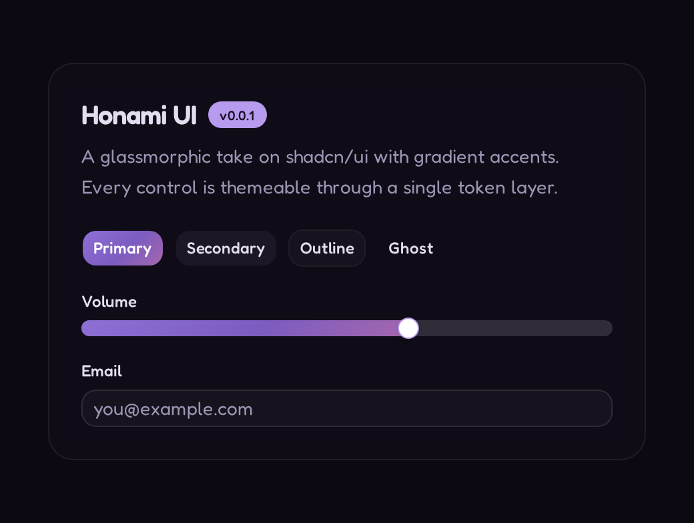 Amethyst | 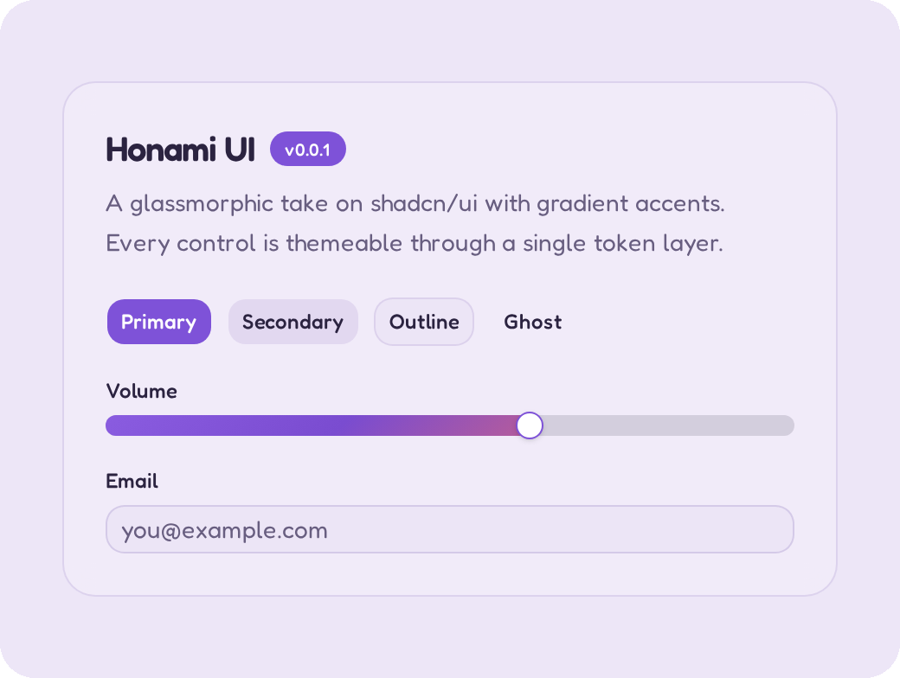 Jasper |
| 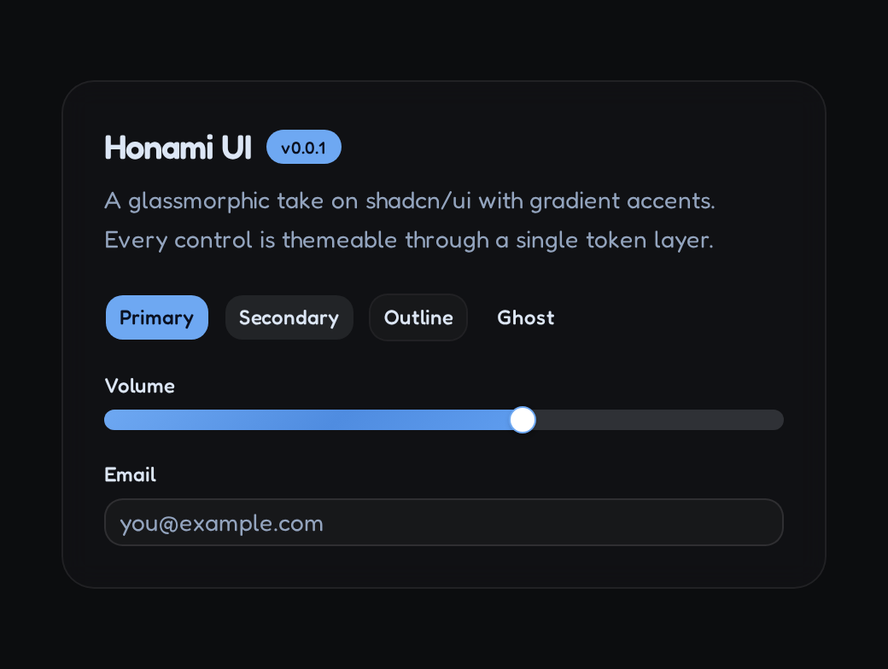 Sapphire | 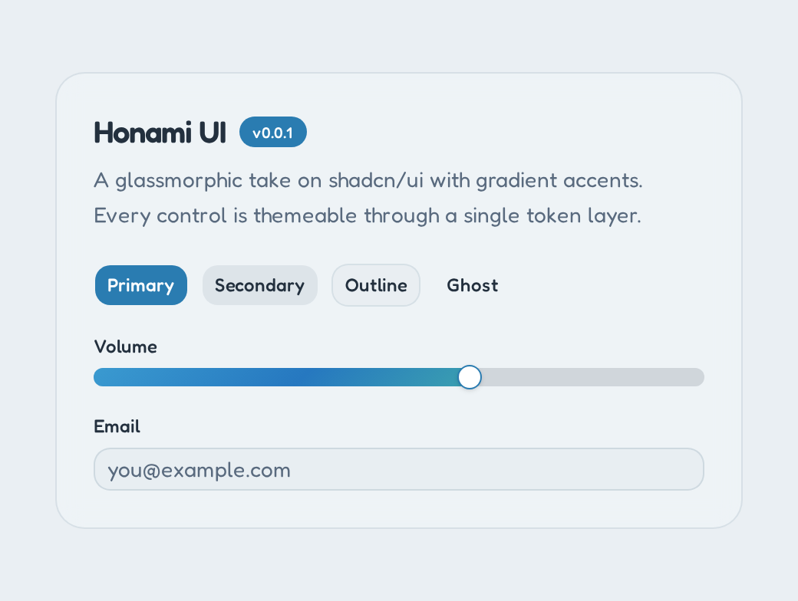 Aquamarine |
| 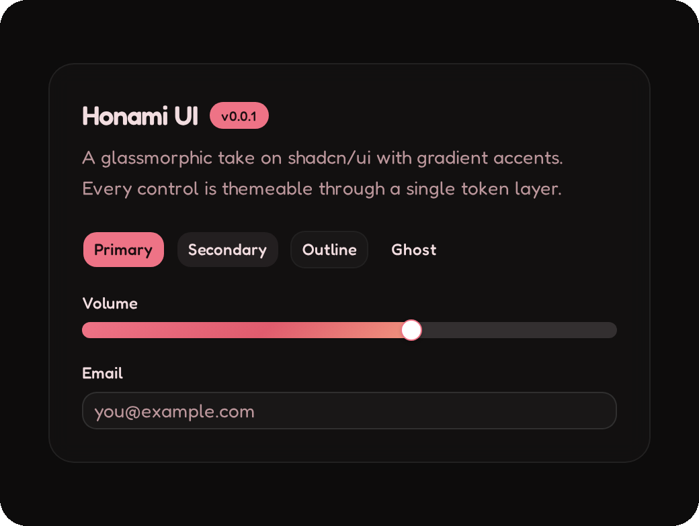 Ruby | 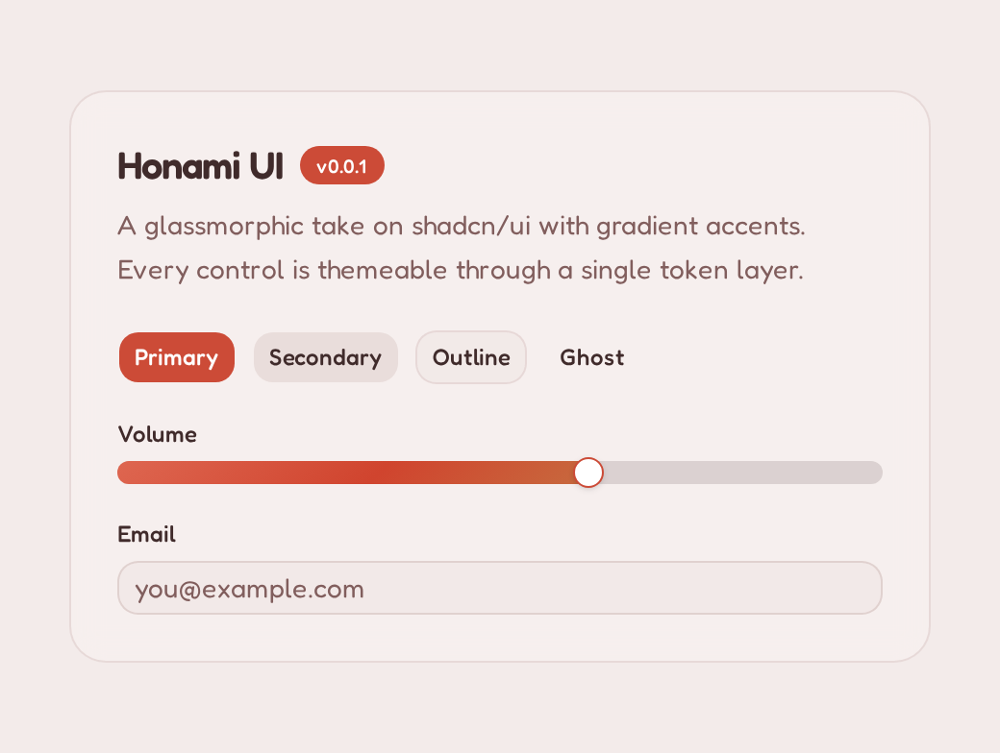 Carnelian |
| 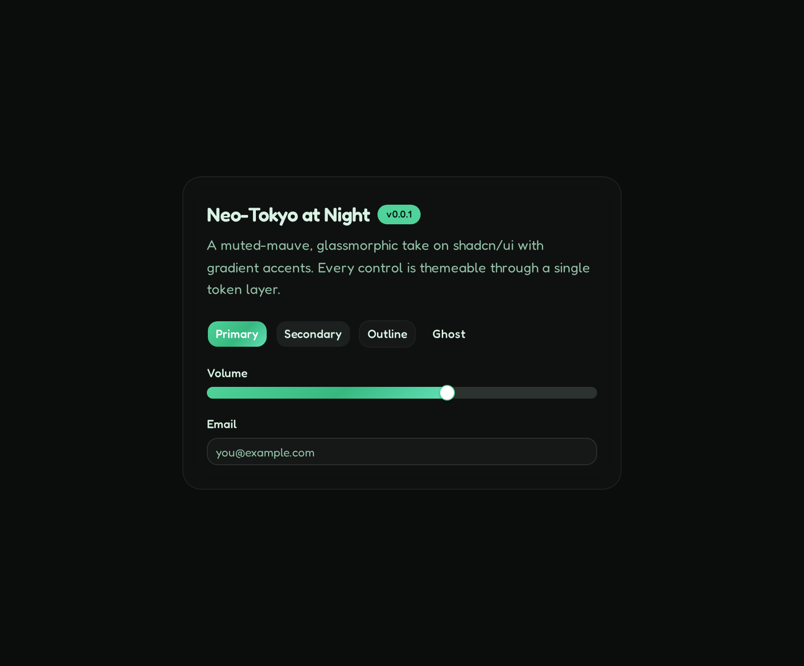 Jade | 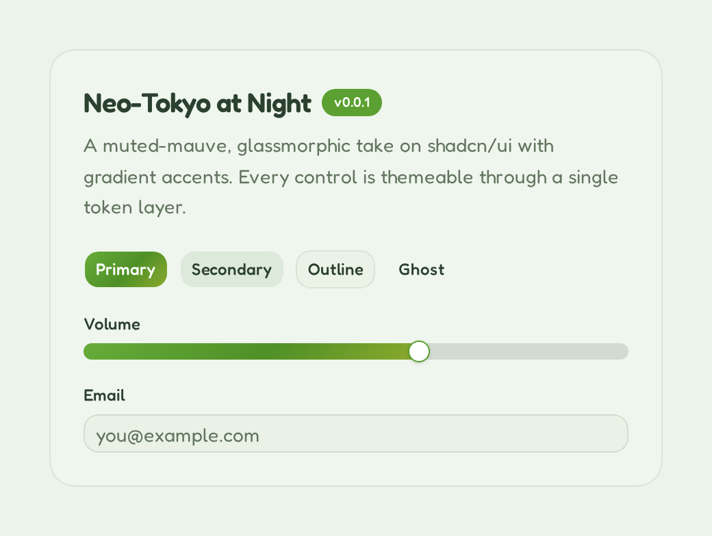 Peridot |
| 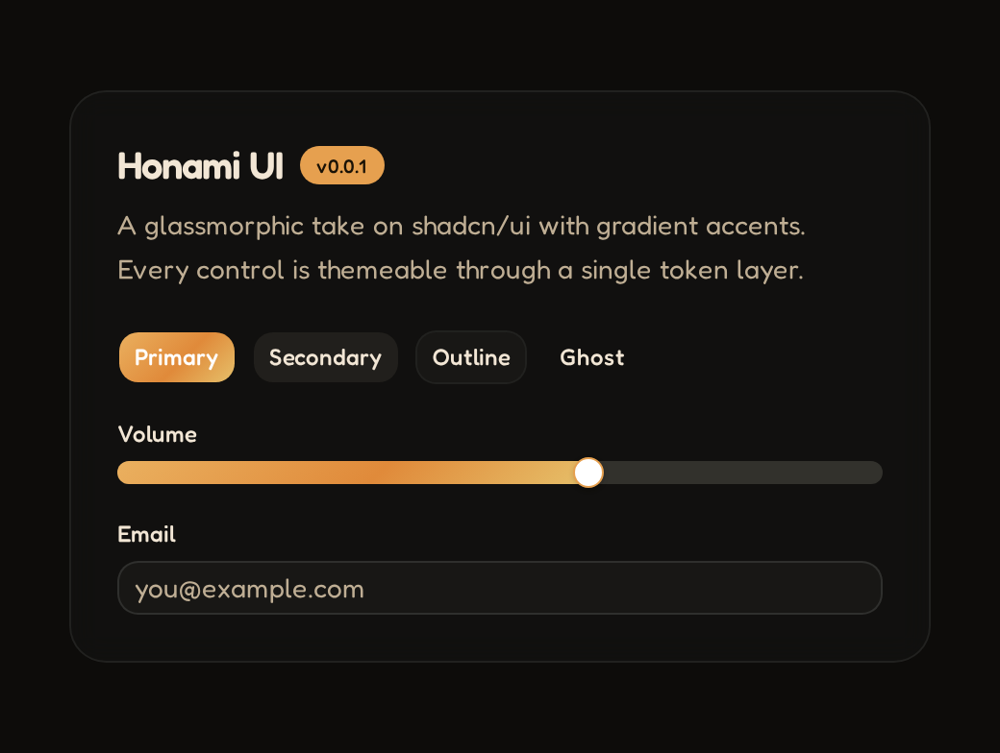 Topaz | 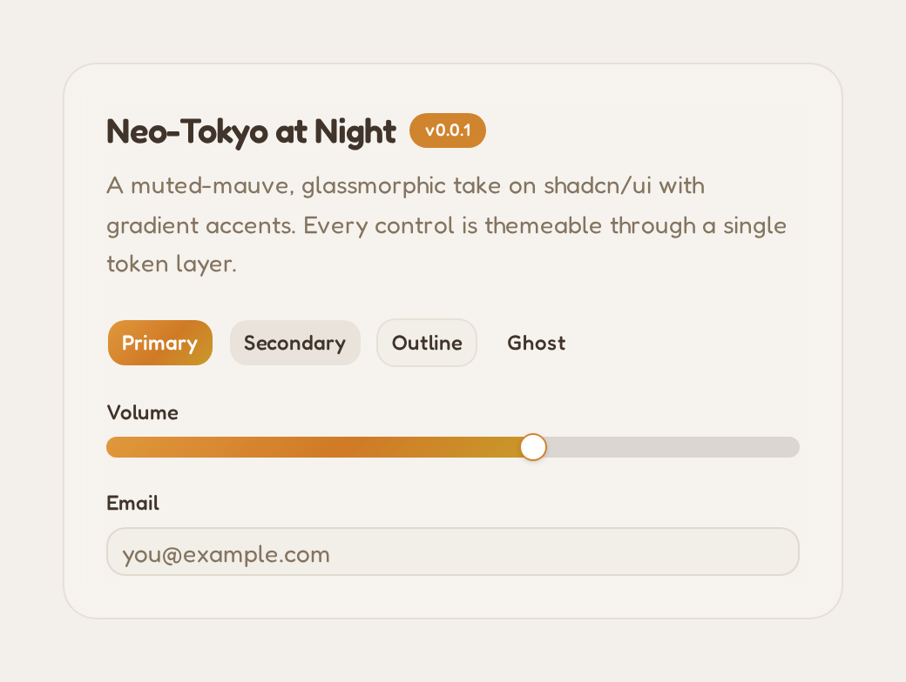 Amber |
| 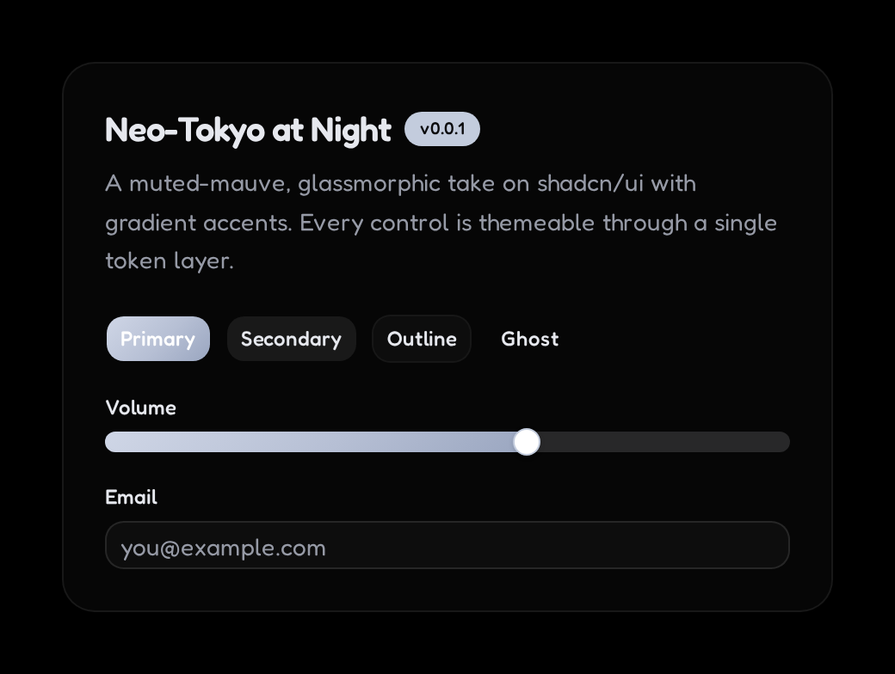 Onyx | 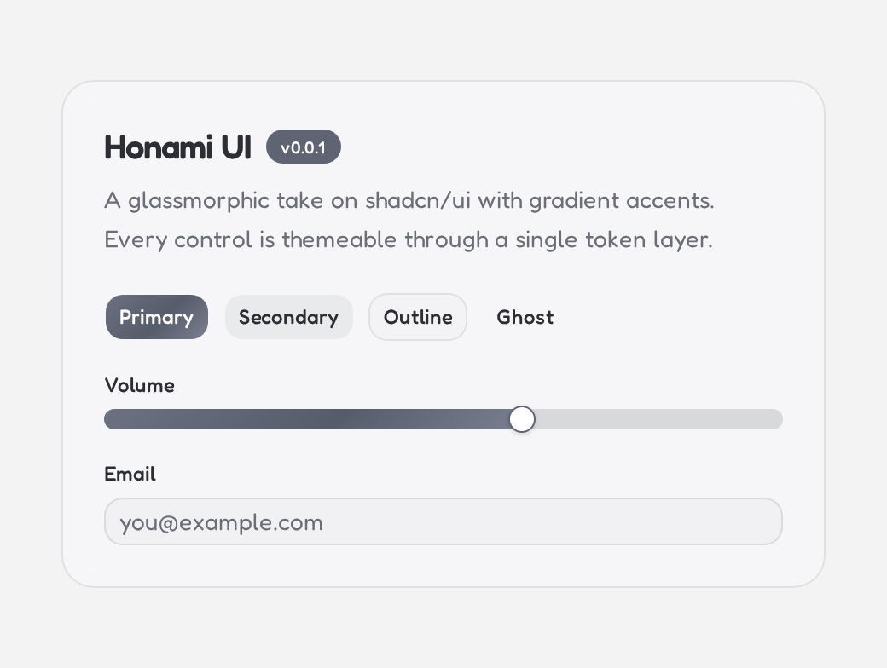 Opal |

## Built on

[shadcn/ui](https://ui.shadcn.com) · [Radix UI](https://www.radix-ui.com) ·
[Base UI](https://base-ui.com) · [Tailwind CSS v4](https://tailwindcss.com) ·
[Solar Icons](https://solar-icons.vercel.app) ·
[Recharts](https://recharts.org) · plus cmdk, vaul, embla, react-day-picker,
input-otp, sonner and next-themes.

## Quickstart

**1. Vendor it as a submodule** and wire it into your pnpm workspace:

```bash
git submodule add https://github.com/iamshiron/shiron-ui.git packages/ui
```

```yaml
# pnpm-workspace.yaml
packages:
  - "apps/*"
  - "packages/*"
```

```jsonc
// your app's package.json
{ "dependencies": { "@shiron/ui": "workspace:*" } }
```

**2. Install the peer dependencies** the library imports:

```bash
pnpm add radix-ui @base-ui/react class-variance-authority clsx \
  tailwind-merge tw-animate-css cmdk vaul embla-carousel-react \
  react-resizable-panels react-day-picker input-otp recharts sonner \
  next-themes @solar-icons/react@2.0.0-beta.2 \
  @fontsource-variable/fredoka @fontsource-variable/azeret-mono
pnpm add -D tailwindcss @tailwindcss/vite
```

**3. Alias the source** in Vite and TypeScript:

```ts
// vite.config.ts
resolve: {
  alias: { "@shiron/ui": path.resolve(__dirname, "../../packages/ui/src") },
}
```

```jsonc
// tsconfig.json
"paths": { "@shiron/ui/*": ["../../packages/ui/src/*"] }
```

**4. Wire the stylesheet** (import once from your entry file):

```css
@import "tailwindcss";
@import "tw-animate-css";
@import "@fontsource-variable/fredoka";
@import "@fontsource-variable/azeret-mono";
@import "@shiron/ui/styles/globals.css";

/* Point Tailwind at the components so their classes get generated. */
@source "../../../../packages/ui/src/components";

/* Solar v2 sizes icons from this variable. */
:root { --solar-size: 0.9rem; }
```

**5. Use it:**

```tsx
import { Button } from "@shiron/ui/components/ui/button";

export function Example() {
  return <Button>Click me</Button>;
}
```

The [Docs page](https://iamshiron.github.io/shiron-ui/docs) walks through the
same steps with more detail.

## Development

```bash
pnpm install
pnpm demo:dev          # run the demo/docs site
pnpm -C demo storybook # run Storybook
pnpm test              # component + CSS-integrity tests
```

## License

[MIT](LICENSE)
